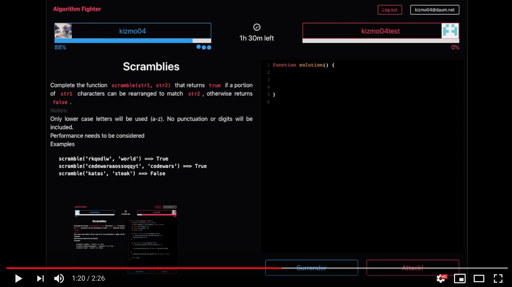

# Algorithm-Fighter-Client

[](https://youtu.be/Jn4B0qwNxrQ)

Algorithm Fighter는 web socket을 활용한 실시간 1:1 대전 방식의 알고리즘 문제 풀이 플랫폼입니다


## Installation

### Client

```
git clone https://github.com/kizmo04/algorithm-fighter-client.git
cd algorithm-fighter-client
npm install
npm start
```

### Server

```
git clone https://github.com/kizmo04/algorithm-fighter-server.git
cd algorithm-fighter-server
npm install
npm start
```


## Features

- Firebase Authentication 을 이용한 Gihub Social Login
- JSON Web Token을 이용한 Stateless Authentication
- Local Storage를 이용한 Client 로그인 유지
- Web Socket 방식의 접속자 간 랜덤 매칭 & 1:1 실시간 대전
- 매칭된 사용자들이 풀지 않은 문제가 우선 선택되도록 Filtering
- 상대방이 타이핑 중일 경우, 애니메이션으로 시각화
- 상대방의 답안이 Submit 되면, 채점 결과를 Progress Bar로 시각화
- 대전 기록을 최근 날짜 순으로 Timeline View
- 풀었던 문제 답안 List 조회
- Node-Cron을 이용해 주기적으로 필요없는 Database 레코드 삭제


## Client-Side

- ES2015+
- Redux
- React, Create-React-App
- HTTP Client fetch API
- Socket.io-Client
- Bulma, Sass


## Server-Side

- ES5+
- Node.js, Express.js
- MongoDB, Mongoose ODM, mlab
- Socket.io
- Node-Cron


## Continuous Integration

- 소스관리/빌드/테스트/배포의 지속적인 통합을 위한 CircleCI (Server)
- Netlify CI (Client)


## Deployment

- AWS Elastic Beanstalk (Server)
- Netlify (Client)


## Project Control

- Web, Server의 독립적인 관리를 위한 GIT Repo 구분
- Branch(Dev, Master) 기반 개발 진행
- Trello를 이용한 Task Management
- Lucid chart를 이용한 Database Schema Modeling Sketch
- Balsamiq Mockup을 이용한 Application View Flow 설계


## Challenges

### 1. Socket In React

React Container 컴포넌트에서 Socket 이벤트를 처리하도록 한 결과, React 컴포넌트의 뷰 로직과 Socket의 유저 매칭, 게임 진행 로직이 뒤섞여버리는 문제가 생겼습니다. 코드베이스에서 로직을 분리하기 위해 먼저, Socket 이벤트를 독립적인 모듈로 분리하고, 콜백 스타일의 함수로 wrapping 했습니다. 또한 유저 매칭 단계부터 게임 종료까지의 앱 상태의 단계(APP_STAGE)를 설정하고 props를 내려받는 가장 상위의 presentational 컴포넌트에서 앱 상태에 따라 분기점을 생성하여 Socket warpper를 호출하도록 했습니다. 결과적으로, 설정해 둔 앱의 상태 단계에 따라서 Socket 이벤트를 등록, 제거 할 수 있도록 했습니다.


### 2. Two Modals

유저에게 진행 상태에 따른 메세지를 대부분 Modal 컴포넌트를 통해 알려주도록 설계되었습니다. 따라서 유저 간 대전 매칭 로직에 따른 Modal과 Sign Up/Log In 로직에 따른 Modal이 각각 필요했습니다. 그래서 Auth Modal과 Match Modal을 각각 만들어 관리하려 했는데, 각 Modal에 내려줘야 하는 Props들이 많아서 가독성이 떨어지고 코드 수정시에 관리가 번거로운 문제가 있었습니다. 결국 한 개의 상위 Modal 컴포넌트를 만들었습니다. Modal의 렌더링 여부는 상위 Modal 컴포넌트 안에서 결정되게 하고, 안에서 props.children을 통해 Contents만 다른 Auth Modal과 Match Modal을 번갈아 렌더링할 수 있도록 수정했습니다.


## Things to do

### 1. Seperation of Concerns

콜백 스타일로 분리한 Socket Event Listener도 현재로써는 컴포넌트와 완전하게 분리되어 있지 않습니다. Socket Event 로직이 컴포넌트 렌더링 로직과 독립적으로 작동할 수 있도록 분리하는 작업을 2차 Task로 설정했습니다.


### 2. Etc

- Component Unit Test
- Server API Unit Test
- Integration Test
- Code Refactoring


### Sincere Thanks

[Ken Huh](https://github.com/Ken123777) / Vanilla Coding
